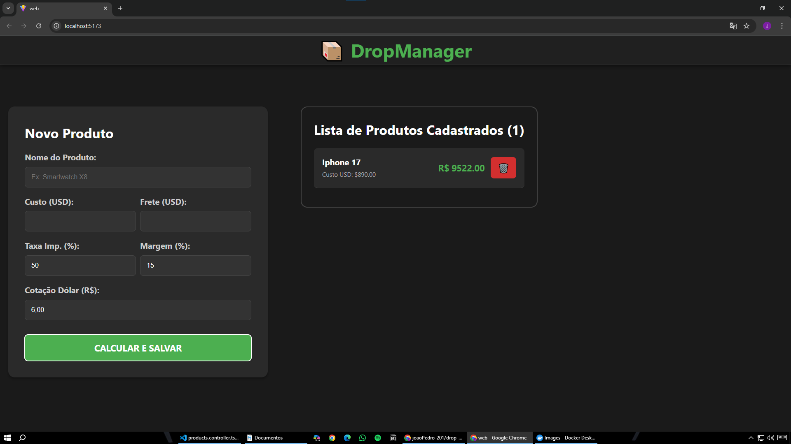

# 📦 DropManager

> Sistema Full Stack de Gestão e Precificação Inteligente para Produtos Importados.



## 💻 Sobre o Projeto

O **DropManager** é uma aplicação desenvolvida para resolver um problema real de quem trabalha com importação e dropshipping: a precificação correta.

Diferente de um CRUD simples, este sistema encapsula regras de negócio financeiras, calculando automaticamente o preço final de venda com base em:
* Custo do Produto (USD)
* Frete Internacional (USD)
* Taxa de Importação (Configurável, padrão 60%)
* Margem de Lucro Desejada (%)
* Cotação do Dólar em Tempo Real (Input manual para simulação)

## 🛠 Tecnologias Utilizadas

O projeto foi desenvolvido utilizando as melhores práticas de mercado e arquitetura limpa.

**Back-end:**
*  **NestJS** (Framework robusto e escalável)
*  **TypeScript**
*  **TypeORM** (ORM para persistência de dados)
* **Class-Validator** (Segurança e validação de dados de entrada - DTOs)

**Front-end:**
*  **React** (Biblioteca para interfaces)
*  **Vite** (Build tool ultra-rápida)
* **CSS Puro (Custom)** (Layout responsivo com CSS Flexbox e Grid)

**Infraestrutura:**
*  **Docker & Docker Compose**
*  **PostgreSQL** (Banco de dados relacional)

## ⚙️ Funcionalidades

- [x] **Cadastro de Produtos:** Interface intuitiva para inserção de custos e variáveis.
- [x] **Cálculo Automático:** O backend processa a conversão cambial e aplica as taxas tributárias automaticamente.
- [x] **Listagem Visual:** Visualização clara dos produtos cadastrados com destaque para o Preço Final Sugerido.
- [x] **Exclusão (CRUD):** Possibilidade de remover produtos da lista e do banco de dados.
- [x] **Persistência de Dados:** Todos os dados são salvos em um banco PostgreSQL rodando em container.

## 🚀 Como Rodar o Projeto

### Pré-requisitos
* Node.js instalado
* Docker e Docker Desktop instalados e rodando

### 1. Clonar o repositório
```bash
git clone [https://github.com/SEU-USUARIO/drop-manager.git](https://github.com/SEU-USUARIO/drop-manager.git)
cd drop-manager
```

### 2. Subir o Banco de Dados (Docker):
* Na raíz do projeto execute:
```bash
docker-compose up -d
```
 Isso criará um container com o PostgreSQL pronto para uso.

### 3. Rodar o Back-end (API)
* Abra um terminal e navegue até a pasta da API:
```bash
cd api
npm install
npm run start:dev
```
 O servidor iniciará em http://localhost:3000

### 4. Rodar o Front-end (Web)
* Abra outro terminal e navegue até a pasta Web:
```bash
cd web
npm install
npm run dev
```
 O site estará disponível em http://localhost:5173

## 📐 Estrutura do Banco de Dados

A entidade `Product` foi modelada para garantir a integridade dos cálculos financeiros:

| Campo | Tipo | Descrição |
|---|---|---|
| `id` | UUID | Identificador único |
| `name` | String | Nome do produto |
| `costPriceUsd` | Decimal | Custo na China |
| `finalPriceBrl` | Decimal | **Preço calculado pelo sistema** |
| `taxRate` | Decimal | Alíquota de imposto (ex: 60%) |
| ... | ... | Outros campos de custo |

---

Desenvolvido por **João Pedro**.
